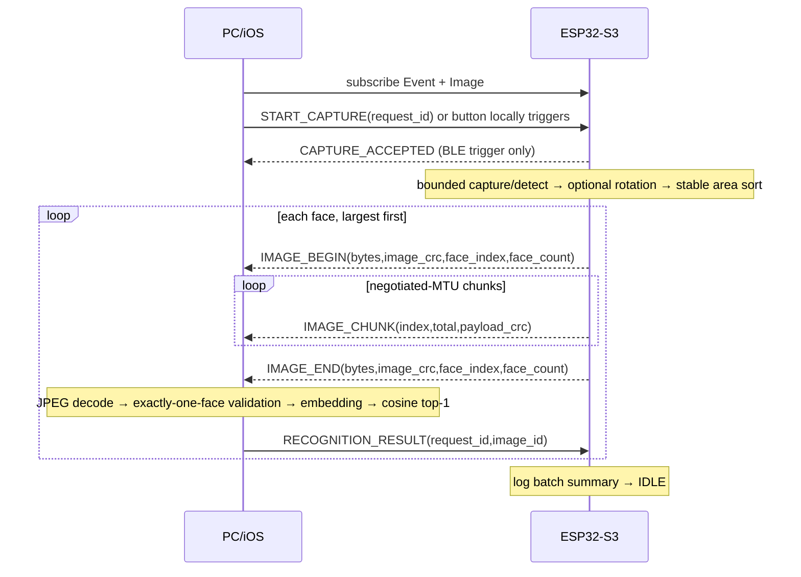

# BLE Application Protocol v2

`protocol/ble_protocol.yaml` is the normative single source of truth. Firmware, Python, and Swift constants are checked by `pc_client/tests/test_protocol_consistency.py`.

## GATT service

| Attribute | UUID | Properties | Permissions / purpose |
|---|---|---|---|
| Service | `7f510000-b7b2-4f6a-9f3a-6c8a2d7e1000` | primary | face demo service |
| Control | `7f510001-b7b2-4f6a-9f3a-6c8a2d7e1000` | Write, Write Without Response | client commands |
| Event | `7f510002-b7b2-4f6a-9f3a-6c8a2d7e1000` | Notify, Read | status/control events; read returns last bounded event |
| Image Data | `7f510003-b7b2-4f6a-9f3a-6c8a2d7e1000` | Notify | image chunks |
| Recognition Result | `7f510004-b7b2-4f6a-9f3a-6c8a2d7e1000` | Write | client result response |
| Device Information | `7f510005-b7b2-4f6a-9f3a-6c8a2d7e1000` | Read | protocol/firmware/model/build/max-image/features |

Development mode permits unencrypted read/write. Production permission requirements are encrypted + authenticated writes for Control and Recognition Result, encrypted reads/notifies, bonding, and an application-authorized peer.

## Packet header

All integers and IEEE-754 `float32` values are **little-endian**. Strings are UTF-8 without NUL terminators. The fixed header is 32 bytes:

| Offset | Bytes | Field | Meaning |
|---:|---:|---|---|
| 0 | 4 | magic | `0x45434146`; bytes on wire spell `FACE` |
| 4 | 1 | protocol_version | `2` |
| 5 | 1 | message_type | table below |
| 6 | 2 | flags | message flags; `0x0001` is `FACE_SEQUENCE` |
| 8 | 4 | request_id | operation correlation |
| 12 | 4 | image_id | ESP32-generated image correlation |
| 16 | 4 | payload_length | bytes following header |
| 20 | 2 | chunk_index | zero-based for IMAGE_CHUNK |
| 22 | 2 | total_chunks | stable for all chunks |
| 24 | 4 | CRC32 | IEEE CRC32 of this packet payload |
| 28 | 4 | reserved | message-specific metadata; see face sequence and Phase 5 notes |

Maximum application image is 163,840 bytes. `person_id` is at most 32 UTF-8 bytes and name at most 64. Unknown fields are not appended in v2; future versions use a new major protocol version or optional-message flag.

| Code | Message | Direction / payload |
|---:|---|---|
| 1/2 | HELLO / HELLO_ACK | capability negotiation |
| 3 | START_CAPTURE | client→Control; `<command:u16,reserved:u16,timestamp_s:u32>` |
| 4 | CAPTURE_ACCEPTED | ESP→Event |
| 5 | BUSY | ESP→Event; requested ID in header, active image ID, current state in reserved |
| 6 | STATUS | ESP→Event |
| 7 | IMAGE_BEGIN | ESP→Event; `<image_bytes:u32,image_crc32:u32>` |
| 8 | IMAGE_CHUNK | ESP→Image Data; sequence fields + bytes |
| 9 | IMAGE_END | ESP→Event; repeats begin metadata and means application transfer complete |
| 10 | RECOGNITION_RESULT | client→Result; layout below |
| 11/12 | NO_FACE / ERROR | ESP→Event; ERROR payload begins with `error_code:u16` |
| 13/14 | PING / PONG | liveness |
| 15 | EVENT_OPEN | ESP→Event; Event ID and VAD trigger; associates header request ID |
| 16 | EVENT_AUDIO_READY | ESP→Event; audio terminal status and sample range; no audio bytes |
| 17 | FACE_BATCH_END | ESP→Event; explicit terminal face status and counters |
| 18 | EVENT_COMPLETE | ESP→Event; final Event/audio/face statuses |

Recognition result fixed prefix is `status:u8, person_id_len:u8, name_len:u8, reserved:u8, similarity:f32, processing_time_ms:u32`, followed by optional UTF-8 ID and name. `person_id`, never the display name, is the stable identity key.

For a face JPEG, IMAGE_BEGIN and IMAGE_END set `FACE_SEQUENCE` and pack zero-based `face_index` into `reserved[15:0]` and `face_count` into `reserved[31:16]`. `face_count` must be nonzero, `face_index < face_count`, and both packets must carry identical sequence metadata. IMAGE_CHUNK remains correlated by request/image IDs and does not repeat the face metadata. An image without `FACE_SEQUENCE` is interpreted as face 0 of 1. These layouts and the recognition-result payload are unchanged from v1.

## Event 1 association payloads

Every Event message has zero image ID, flags, chunk fields and header reserved. Its header request ID is the associated face request, or zero when no request was accepted. Zero never forms a global request mapping. All reserved payload bytes are zero. The wire layouts are:

| Message | Bytes | Python struct | Fields in order |
|---|---:|---|---|
| EVENT_OPEN | 16 | `<QB7x` | event_id:u64, trigger_type:u8, reserved[7] |
| EVENT_AUDIO_READY | 32 | `<QB7xQQ` | event_id:u64, audio_status:u8, reserved[7], first_sample:u64, last_sample:u64 |
| FACE_BATCH_END | 32 | `<QIHHHHHB9x` | event_id:u64, request_id:u32, expected:u16, completed:u16, recognized:u16, unknown:u16, failed:u16, face_status:u8, reserved[9] |
| EVENT_COMPLETE | 16 | `<QBBB5x` | event_id:u64, event_status:u8, audio_status:u8, face_status:u8, reserved[5] |

FACE_BATCH_END's status is at byte 22; nine reserved bytes make its payload 32 bytes. `completed = recognized + unknown + failed`, and `completed <= expected`. UNKNOWN is a completed face association. Trigger source Event1/VAD is 3. Audio statuses are PENDING=0, READY=1, FAILED=2. Face statuses are PENDING=0, COMPLETED=1, NO_FACE=2, PARTIAL=3, BUSY=4, TIMEOUT=5, DISCONNECTED=6, FAILED=7. Event statuses are COMPLETE=0 and COMPLETE_WITH_ERROR=1. COMPLETE requires READY audio plus COMPLETED or NO_FACE; every other terminal combination uses COMPLETE_WITH_ERROR.

`event_id = boot_session_id << 32 | event_sequence`. The PC and SD represent it as 16 uppercase hex digits, including leading zeros. Request/image ownership is scoped to the boot session because counters restart on reboot. EVENT_OPEN must precede images; audio/face terminal messages may arrive before OPEN and create a durable shell record. Identical OPEN/terminal retransmissions are idempotent; conflicting ownership or terminal contents are rejected. EVENT_COMPLETE requires both branch terminals. A BLE disconnect preserves received faces and recognition results, marks pending faces DISCONNECTED locally, and leaves pending audio and Event completion pending until authoritative device metadata is available.

Disconnect/reconnect clears active request/image mappings and the inferred boot session. Images arriving before the new connection receives an Event message remain manual captures; they cannot inherit a previous connection's Event ownership. Durable old Event rows remain available for inspection, and an old recognizer cannot write its result to a newly reused request ID.

The PC maintains a separate `EventStore` SQLite file (`event_store.db` by default), with `events` and `event_faces`. It persists recognition before attempting the BLE response, including UNKNOWN and FAILED. `result_sent` distinguishes results saved locally from successful BLE writes. READY audio supplies the expected SD filename `event_<EVENT_ID>.wav`; Event 1 does not transfer that WAV to the PC. Set the path with `python -m pc_client --event-database events.db run --wait-only`, or pass `event_store=` / `event_database=` to `BleFaceSession`.

## IDs and ordering

Client request IDs are nonzero and bit 31 is clear. External-button and Event 1 request IDs are generated by the ESP32 with bit 31 set. Reuse within the firmware's recent-ID window is rejected. Every face in an accepted request receives a unique ESP32-generated `image_id`; all faces retain the request ID. A result must match the currently active request/image IDs; stale or wrong results are ignored and reported.

Exactly one request may be active. Its configured face-detection recaptures keep the first image ID, and its sorted faces are transferred one at a time while the request remains BUSY. A trigger during any state other than IDLE receives BUSY and is not queued. The original camera frame is retained until every face has been copied; the crop and JPEG slots are reused per face. The JPEG slot is reclaimed after IMAGE_END before waiting for that face's recognition result. A timeout, disconnect, or pipeline failure aborts the remaining faces.

## MTU, chunks, CRC, and timing

The peripheral prefers MTU 517 but never assumes it. ATT notification value capacity is `MTU - 3`. IMAGE_CHUNK byte capacity is therefore:

```text
chunk_payload = negotiated_MTU - 3 - 32
```

MTU must be at least 36 for the header plus one payload byte. A smaller MTU is a protocol error. The PC validates per-chunk CRC, request/image IDs, stable total count, duplicates, missing and out-of-order sequences. Duplicates with identical bytes are counted; conflicting duplicates fail. IMAGE_END additionally validates whole-image byte count and CRC32.

Event 1 requires ATT MTU **67** for its largest notification (`32-byte header + 32-byte payload + 3-byte ATT overhead`). Event messages are never truncated or fragmented into image chunks. A smaller MTU can prevent Event publication; local audio/SD ownership still remains intact.

Each capture has a 4 s bounded wait (in pinned esp32-camera 2.1.7) and each detection invocation has a 6 s policy. The default no-face fallback is one initial capture plus two recaptures, followed by one 180-degree detection of the final frame; therefore it permits at most three captures and four detector invocations before `NO_FACE`. Encoding is 3 s, image transfer/reassembly 15 s, and recognition response 15 s. BLE notification allocation and queue congestion use 5 ms backpressure retries for at most 500 ms per notification. RSSI is sampled no more than once per second.

## State and timing diagrams

```mermaid
stateDiagram-v2
  [*] --> INITIALIZING
  INITIALIZING --> IDLE
  IDLE --> CAPTURING: accepted trigger
  CAPTURING --> DETECTING
  DETECTING --> CAPTURING: no face; recaptures remain
  DETECTING --> DETECTING: rotate final frame 180 degrees once
  DETECTING --> NO_FACE: all attempts have no valid box
  DETECTING --> CROPPING: sort all faces by area
  CROPPING --> ENCODING
  ENCODING --> TRANSMITTING
  TRANSMITTING --> WAITING_RESULT: IMAGE_END
  WAITING_RESULT --> CROPPING: matching result; more faces
  WAITING_RESULT --> COMPLETED: matching result; final face
  COMPLETED --> IDLE
  NO_FACE --> IDLE
  CAPTURING --> ERROR_RECOVERY
  DETECTING --> ERROR_RECOVERY
  CROPPING --> ERROR_RECOVERY
  ENCODING --> ERROR_RECOVERY
  TRANSMITTING --> ERROR_RECOVERY
  WAITING_RESULT --> ERROR_RECOVERY
  ERROR_RECOVERY --> IDLE
```





## Disconnect/reconnect and errors

On disconnect, the ESP32 stops sending, counts failure/disconnect, releases image ownership in controller recovery, and resumes advertising. The client reconnects, discovers characteristics, and resubscribes; partial images are discarded, never resumed. A fresh request ID is required. Peer-not-subscribed and insufficient-MTU failures are reported without taking another photo.

Error codes 0–22 are defined in YAML and include invalid packet/version/CRC, BUSY/duplicate, camera/PSRAM/capture/model/bbox/crop/JPEG, connection/subscription/congestion/disconnect, image timeout/missing chunk, recognition timeout/stale/wrong image, and internal failure.

Sample PING request (`request_id=1`, empty payload):

```text
46 41 43 45 02 0D 00 00 01 00 00 00 00 00 00 00
00 00 00 00 00 00 00 00 00 00 00 00 00 00 00 00
```

PC flow uses Bleak scan/connect/discover, subscribes Event and Image, optionally writes START_CAPTURE, reassembles and validates JPEG, runs InsightFace, then writes result. iOS follows the same sequence with `CBCentralManager`, `CBPeripheral`, `.withResponse` Control/Result writes, notify subscriptions, `maximumWriteValueLength`/negotiated notification behavior, and `BLEProtocol.swift` packet validation. No iOS UI is included.

Backward compatibility: v1 peers reject v2 as an unsupported major version; v2 peers reject v1. Upgrade firmware and client together. The 32-byte header offsets, existing message IDs 1–14, UUIDs, image/recognition payloads and FACE_SEQUENCE packing are preserved. v2 clients interpret an unflagged image as face 0 of 1. The host suite checks the normative YAML against Python/C++/Swift constants and compiles the C++ serializers to compare complete golden packets against Python.
