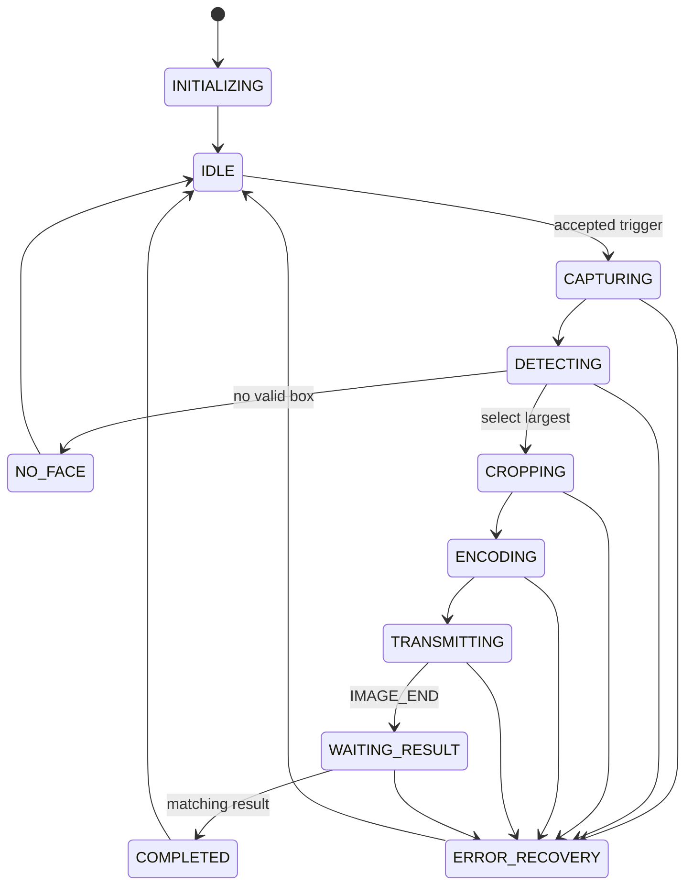
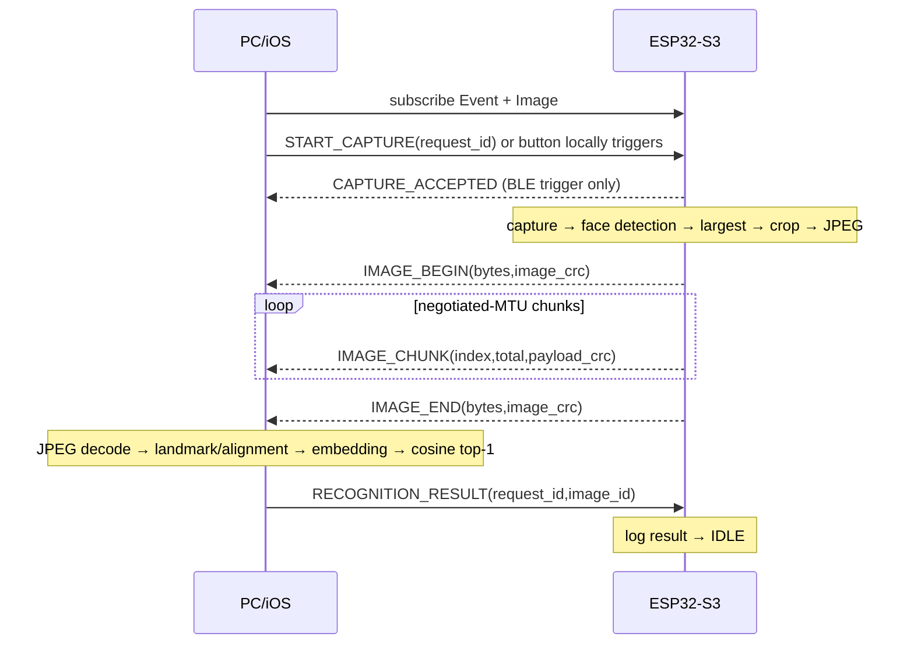

# BLE Application Protocol v1

`protocol/ble_protocol.yaml` is the normative single source of truth. Firmware, Python, and Swift constants are checked by `pc_client/tests/test_protocol_consistency.py`.

## GATT service

| Attribute | UUID | Properties | Permissions / purpose |
|---|---|---|---|
| Service | `7f510000-b7b2-4f6a-9f3a-6c8a2d7e1000` | primary | face demo service |
| Control | `7f510001-b7b2-4f6a-9f3a-6c8a2d7e1000` | Write, Write Without Response | client commands |
| Event | `7f510002-b7b2-4f6a-9f3a-6c8a2d7e1000` | Notify, Read | status/control events; read returns last bounded event |
| Image Data | `7f510003-b7b2-4f6a-9f3a-6c8a2d7e1000` | Notify | image chunks |
| Recognition Result | `7f510004-b7b2-4f6a-9f3a-6c8a2d7e1000` | Write | client result response |
| Device Information | `7f510005-b7b2-4f6a-9f3a-6c8a2d7e1000` | Read | protocol/firmware/model/build/max-image/features |

Development mode permits unencrypted read/write. Production permission requirements are encrypted + authenticated writes for Control and Recognition Result, encrypted reads/notifies, bonding, and an application-authorized peer.

## Packet header

All integers and IEEE-754 `float32` values are **little-endian**. Strings are UTF-8 without NUL terminators. The fixed header is 32 bytes:

| Offset | Bytes | Field | Meaning |
|---:|---:|---|---|
| 0 | 4 | magic | `0x45434146`; bytes on wire spell `FACE` |
| 4 | 1 | protocol_version | `1` |
| 5 | 1 | message_type | table below |
| 6 | 2 | flags | message/feature flags |
| 8 | 4 | request_id | operation correlation |
| 12 | 4 | image_id | ESP32-generated image correlation |
| 16 | 4 | payload_length | bytes following header |
| 20 | 2 | chunk_index | zero-based for IMAGE_CHUNK |
| 22 | 2 | total_chunks | stable for all chunks |
| 24 | 4 | CRC32 | IEEE CRC32 of this packet payload |
| 28 | 4 | reserved | zero unless documented; Phase 5 uses desired synthetic bytes |

Maximum application image is 163,840 bytes. `person_id` is at most 32 UTF-8 bytes and name at most 64. Unknown fields are not appended in v1; future versions use a new major protocol version or optional-message flag.

| Code | Message | Direction / payload |
|---:|---|---|
| 1/2 | HELLO / HELLO_ACK | capability negotiation |
| 3 | START_CAPTURE | client→Control; `<command:u16,reserved:u16,timestamp_s:u32>` |
| 4 | CAPTURE_ACCEPTED | ESP→Event |
| 5 | BUSY | ESP→Event; requested ID in header, active image ID, current state in reserved |
| 6 | STATUS | ESP→Event |
| 7 | IMAGE_BEGIN | ESP→Event; `<image_bytes:u32,image_crc32:u32>` |
| 8 | IMAGE_CHUNK | ESP→Image Data; sequence fields + bytes |
| 9 | IMAGE_END | ESP→Event; repeats begin metadata and means application transfer complete |
| 10 | RECOGNITION_RESULT | client→Result; layout below |
| 11/12 | NO_FACE / ERROR | ESP→Event; ERROR payload begins with `error_code:u16` |
| 13/14 | PING / PONG | liveness |

Recognition result fixed prefix is `status:u8, person_id_len:u8, name_len:u8, reserved:u8, similarity:f32, processing_time_ms:u32`, followed by optional UTF-8 ID and name. `person_id`, never the display name, is the stable identity key.

## IDs and ordering

Client request IDs are nonzero and bit 31 is clear. External-button request IDs are generated by the ESP32 with bit 31 set. Reuse within the firmware's recent-ID window is rejected. `image_id` is generated by the ESP32 for each accepted request. A result must match both active IDs; stale/wrong results are ignored and reported.

Exactly one capture may be active. A trigger during any state other than IDLE receives BUSY and is not queued. The JPEG slot is held until IMAGE_END has been submitted, then reclaimed. Disconnect aborts transfer and reclaims all buffers.

## MTU, chunks, CRC, and timing

The peripheral prefers MTU 517 but never assumes it. ATT notification value capacity is `MTU - 3`. IMAGE_CHUNK byte capacity is therefore:

```text
chunk_payload = negotiated_MTU - 3 - 32
```

MTU must be at least 36 for the header plus one payload byte. A smaller MTU is a protocol error. The PC validates per-chunk CRC, request/image IDs, stable total count, duplicates, missing and out-of-order sequences. Duplicates with identical bytes are counted; conflicting duplicates fail. IMAGE_END additionally validates whole-image byte count and CRC32.

Capture 4 s (the bounded wait in pinned esp32-camera 2.1.7), detection 6 s, encoding 3 s, image transfer/reassembly 15 s, and recognition response 15 s. BLE notification allocation and queue congestion use 5 ms backpressure retries for at most 500 ms per notification. RSSI is sampled no more than once per second.

## State and timing diagrams





## Disconnect/reconnect and errors

On disconnect, the ESP32 stops sending, counts failure/disconnect, releases image ownership in controller recovery, and resumes advertising. The client reconnects, discovers characteristics, and resubscribes; partial images are discarded, never resumed. A fresh request ID is required. Peer-not-subscribed and insufficient-MTU failures are reported without taking another photo.

Error codes 0–22 are defined in YAML and include invalid packet/version/CRC, BUSY/duplicate, camera/PSRAM/capture/model/bbox/crop/JPEG, connection/subscription/congestion/disconnect, image timeout/missing chunk, recognition timeout/stale/wrong image, and internal failure.

Sample PING request (`request_id=1`, empty payload):

```text
46 41 43 45 01 0D 00 00 01 00 00 00 00 00 00 00
00 00 00 00 00 00 00 00 00 00 00 00 00 00 00 00
```

PC flow uses Bleak scan/connect/discover, subscribes Event and Image, optionally writes START_CAPTURE, reassembles and validates JPEG, runs InsightFace, then writes result. iOS follows the same sequence with `CBCentralManager`, `CBPeripheral`, `.withResponse` Control/Result writes, notify subscriptions, `maximumWriteValueLength`/negotiated notification behavior, and `BLEProtocol.swift` packet validation. No iOS UI is included.

Backward compatibility: v1 peers reject an unsupported major version and unknown mandatory message. New optional message types may be ignored only when a future optional flag explicitly says so; existing numeric meanings, UUIDs, and field offsets are immutable within v1.
